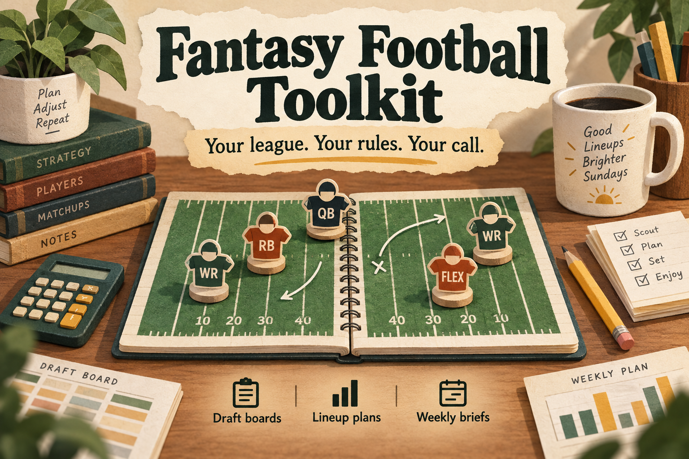

# Fantasy Football Toolkit



> **TL;DR:** Turn your fantasy league's rules into draft boards, clear lineup plans and weekly briefs. Free, open source, and built to show its work. [See an example](examples/demo-output.txt) or [try the offline demo](#try-it-without-an-account).

[](https://github.com/jessecmaddox3/fantasy-football-toolkit/actions/workflows/tests.yml)
[](LICENSE)

I built this for my own personal use. I wanted one place to work through different league rules, check a lineup and see what needed my attention that week. This is the reusable toolkit, with invented examples in place of my league information.

Make it your own, and feel free to help improve mine. Hopefully it gives you a useful starting point, or at least a few ideas. Cheers!

**What you'll get:** a Python command-line app for Sleeper and ESPN. It supports redraft, keeper and dynasty formats, including PPR, superflex and TE premiums. It does the calculations locally. You review its suggestions and make changes in your fantasy platform. No AI subscription or model API key is needed.

## Try it without an account

**Just looking?** [Open the complete fictional example](examples/demo-output.txt). It shows a draft board, a recommended starting lineup, and exactly who to bench, move or start. You don't need to install anything to read it.

**Want to run it?** Follow the [first-time setup guide](docs/GETTING_STARTED.md). It explains where to click, where to paste the commands, and what success looks like on Windows, Mac and Linux. You need Python 3.11 or newer and an internet connection for installation. Git and a GitHub account are not required. This is a terminal app, not a phone app or a website you log into.

Already comfortable in a terminal? On Mac/Linux:

```bash
python3 -m venv .venv
.venv/bin/python -m pip install "https://github.com/jessecmaddox3/fantasy-football-toolkit/releases/download/v0.2.0/fantasy_football_toolkit-0.2.0-py3-none-any.whl"
.venv/bin/python -m ff.cli demo
```

On Windows PowerShell:

```powershell
py -m venv .venv
.\.venv\Scripts\python.exe -m pip install "https://github.com/jessecmaddox3/fantasy-football-toolkit/releases/download/v0.2.0/fantasy_football_toolkit-0.2.0-py3-none-any.whl"
.\.venv\Scripts\python.exe -m ff.cli demo
```

The demo uses entirely fictional players and invented projections. Once installed, it makes no network requests, reads no league config and writes no files. Installation downloads the toolkit and its dependencies. This package is distributed through [GitHub releases](https://github.com/jessecmaddox3/fantasy-football-toolkit/releases), not PyPI.

## What it does

- **Draft boards:** score supplied player projections under your league rules, rank by value over replacement, select format-appropriate ADP, and attach bye weeks.
- **Lineups:** solve starting slots and flex eligibility together, compare current and recommended starters, and account for kickoff locks, byes and unavailable players.
- **Weekly consensus:** attach dated FantasyPros positional ranks as an extra reference, with explicit unavailable/unmatched notices. The optimizer still uses your league's scoring.
- **Weekly briefs:** combine standings, roster flags, upcoming byes, waiver settings, deadlines and lineup decisions across configured leagues. Sleeper also supports retrospective bench-point analysis.
- **Dynasty rookie boards:** select first-year players and optionally join DynastyProcess trade values. Its comparison columns currently use superflex values, even for a one-QB league.

This is an **alpha developer tool**. It does not submit waiver claims, trades, lineup changes or messages. You make changes in your fantasy platform yourself.

## Connect your own leagues

The commands below use the shorthand `ff`. After the setup above, replace `ff` with `.venv/bin/python -m ff.cli` on Mac/Linux or `.\.venv\Scripts\python.exe -m ff.cli` on Windows. Run them from your toolkit folder.

Download [examples/leagues.toml](examples/leagues.toml), save it as `leagues.toml` in your working directory, and replace the placeholder IDs. Remove any example leagues you do not use.

For Sleeper, use the numeric league ID from its web URL and your numeric user ID. You can look up a username with `https://api.sleeper.app/v1/user/YOUR_USERNAME`; use the returned `user_id`. No Sleeper API key is required. [Official API documentation](https://docs.sleeper.com/).

```toml
[leagues.home]
name = "My home league"
platform = "sleeper"
league_id = "YOUR_NUMERIC_LEAGUE_ID"
user_id = "YOUR_NUMERIC_USER_ID"
season = 2026
```

```bash
ff board --league home --top 25
ff lineup --league home --week 1
ff lineup --all --week 1
ff brief --week 1
```

Use `--config /path/to/leagues.toml` after the subcommand, or set `FF_CONFIG`. The config is validated before live requests. `--season` overrides the configured season; otherwise selected leagues must share a season. Lineup/brief default to the week reported by Sleeper. `--ignore-locks` is for hypothetical analysis before kickoff, not executable lineup advice.

For dynasty: `ff board --league dynasty --rookies --top 30` after adding a league with that key.

**ESPN:** configure `platform = "espn"`, your numeric `league_id`, `team_id` and `season`. Set `ESPN_S2` and `SWID` in your environment or a local `.env` file using cookies from your own ESPN session. Both cookies are currently required by this adapter, including for public leagues. `FF_ESPN_ENV` can select an explicit file. Environment values take precedence. Cookies can expire; ESPN is an unofficial integration and may change without notice.

Never put credentials in the TOML file or an issue report. Keep your local config, `.env`, cache and output private. Cache and report writes use atomic replacement and owner-only files on POSIX systems; on Windows, use a private user folder with appropriate account permissions. Standard filenames are gitignored, but custom filenames need equivalent protection.

## Weekly consensus

Lineup and brief commands request the relevant FantasyPros weekly scopes. An eligible cache is reused for six hours; a source update more than 48 hours old, wrong week/season, invalid response or failed refresh yields an explicit **UNAVAILABLE** note. It never falls back to expired rankings. Source and retrieval times are shown separately. Ambiguous player matches remain unmatched; defense matching uses a unique canonical team.

To refresh all six supported scopes, with no league configuration required:

```bash
ff refresh-fantasypros --season 2026 --week 2
```

Set the season and week you actually want. If you omit the week, the reported current season must match. These are live public-page adapters, not a historical rankings archive. Availability can change. A partial refresh or a failure to save its cache exits with a nonzero status. The scopes are standard/half/PPR flex and standard QB, defense and kicker. Nonstandard reception scoring is only approximated by a reference bucket. ECR is consensus rank, not ADP or a prediction of points.

## Outputs and data sources

The defaults are relative to the directory where you run the command:

- `data/cache/`: downloaded provider responses; override with `FF_CACHE_DIR`.
- `data/out/brief_weekN.md`: weekly brief; override the directory with `FF_OUTPUT_DIR`.
- `ff brief --slack`: stages a local Slack JSON payload only. It does not send it.

Sleeper supplies league data and projections; nflverse supplies schedules; Open-Meteo supplies weather; ESPN supplies league data and scoreboard odds. FantasyPros supplies optional reference ranks on lineup and brief runs. Rookie comparisons optionally download DynastyProcess values. The code is MIT licensed; **provider data and service access have separate terms**, including noncommercial restrictions on some free APIs. No provider rankings or private league snapshots are bundled. See [data sources, attribution and terms](NOTICE.md).

## Limitations to understand

Projections are estimates. Value over replacement uses a heuristic allocation of league-wide flex demand; the weekly lineup assignment itself is exact for the supported slot model. Weather and implied-total adjustments are bounded heuristics, not validated predictions of improved fantasy results.

Kicker and defense projections can be incomplete, especially for ESPN scoring fields without a mapped equivalent. Unsupported scoring fields and missing player projections may undercount totals. IDP and unusual position types are not supported. Check your league rules and provider injury updates before acting. Cached information can be stale; use a fresh cache directory when checking a time-sensitive update.

Sleeper projections/ADP and ESPN endpoints are undocumented interfaces. External availability is not covered by the offline test suite. This release is tested with synthetic fixtures. The original release had limited live Sleeper/ESPN board checks; those are not a fresh verification of your league. The six FantasyPros page formats passed a metadata-only compatibility check in September 2026. None of these checks guarantees future provider availability. Owner lookup currently expects the primary Sleeper owner ID. The tool is intended for local use by one manager, not a shared hosted service.

## How I designed it

League settings, provider downloads and calculations are separate pieces so a new source does not require rewriting the scoring engine. The lineup solver handles every starting slot together, including flex. Its explanation names the final slot assignments, rather than pairing unrelated players by points. The full design, tradeoffs and module map are in [DESIGN.md](docs/DESIGN.md). For AI-assisted use, start with the [reusable workflow](docs/AI_WORKFLOW.md).

## Contribute

Useful contributions include reproducible bug reports, clearer setup instructions, missing scoring mappings backed by provider evidence, and new adapters. Start with [CONTRIBUTING.md](CONTRIBUTING.md) and the [roadmap](docs/ROADMAP.md).

```bash
git clone https://github.com/jessecmaddox3/fantasy-football-toolkit.git
cd fantasy-football-toolkit
python -m venv .venv
source .venv/bin/activate
python -m pip install '.[dev]'
python -m pytest tests
```

Tests use synthetic fixtures and block real network connections. AI-assisted contributions are welcome when the contributor understands the change, checks it, and explains how it was verified.

Maintained by [Jess Maddox](https://github.com/jessecmaddox3). Released under the [MIT license](LICENSE). Independently developed; not affiliated with or endorsed by Sleeper, ESPN, the NFL, or data providers.
